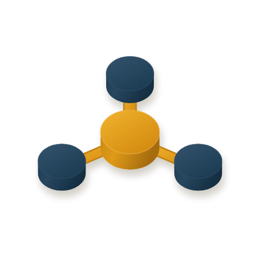

<p align="center">
  
</p>

# Capstan

Capstan is a Laravel application your organisation forks, deploys to its own infrastructure, and runs
for itself. It is not a SaaS product and it is not multi-tenant: one deployment belongs to one
organisation, and you own the server, the database, and the data.

## What it does

Capstan ships two capabilities today. Each one is off until you switch it on.

**Artifact hosting.** Your tools `POST` a page of HTML to Capstan and get back a signed, expiring link
they can share. The HTML is stored privately and served from a second hostname that never receives
your login cookie, inside a locked-down sandbox. That is how untrusted AI-generated HTML is made safe
here — by isolating it, not by stripping tags out of it.

**Postmaster.** A signed message bus. Command-line agents on your machines poll Capstan once a minute,
announce which inboxes they are ready to receive on, and hand work to each other through addresses
like `deploys@<server-id>`. Capstan signs every message it delivers, tracks which agents are alive,
and shows you a map of them.

Together they replace the per-seat link-sharing and agent-messaging tools you would otherwise pay for
per person, with one deployment you control.

## The easy way: Scalpels

You do not have to run Capstan yourself. [Scalpels](https://scalpels.app/products/capstan) deploys and
operates Capstan **in your own Laravel Cloud account**, and handles the parts of this README that are
fiddly: provisioning the database, queue and object storage, wiring up both hostnames, keeping the
app upgraded, and managing who on your team has access.

The infrastructure and the data stay yours — Scalpels is the operator, not the landlord. If you would
rather not think about deploy pipelines, start there: **<https://scalpels.app/products/capstan>**.

The rest of this README is for running it yourself. That path is free and fully supported; it is just
more work.

## Run it yourself

### What you need

| | |
| --- | --- |
| PHP | **8.5 or newer** — this is stricter than most Laravel apps, and an older PHP stops the install |
| Composer | 2.x |
| Node.js | 20.19+ or 22.12+ (Vite 8) |
| A database | SQLite works for local development; PostgreSQL or MySQL in production |
| For deploying | A [Laravel Cloud](https://laravel.com/cloud) account and a hostname you control |

**If you want artifact hosting you need a *second* hostname.** Capstan serves the app on one (say
`capstan.example.com`) and artifact HTML on another (`capstan-artifacts.example.com`). Using one
hostname for both is not a shortcut — Capstan refuses to serve artifacts at all rather than give up
the separation. Postmaster on its own needs only the app hostname.

### 1. Get the code and install it

```bash
git clone https://github.com/artisan-build/capstan.git
cd capstan
composer setup
```

`composer setup` is the whole local install: it installs the PHP packages, copies `.env.example` to
`.env` if you do not have one, generates an app key, creates a SQLite database and migrates it, then
installs and builds the frontend. It will not overwrite an existing `.env`.

The migration step prints a long list of tables ending in `DONE`. Most of them belong to Built for
Cloud, the package that provides Capstan's accounts, sign-in and API credentials.

If PHP is too old, it stops with `Root composer.json requires php ^8.5 but your php version (...) does
not satisfy that requirement`. Install PHP 8.5 and try again.

### 2. Run the tests

```bash
composer ready
```

This formats the code (Pint), type-checks it (PHPStan), then runs the test suite (Pest). A clean
checkout finishes with every tool reporting `passed` and no PHPStan errors. Run this before you open a
pull request — it is the same gate CI uses.

### 3. Create the first account

Nobody can sign in yet, and there is no public sign-up page. Create the first account from the command
line:

```bash
php artisan create-admin --local --email=you@example.com --name="Your Name"
```

It asks for a password twice, then prints `Admin user you@example.com created.` Ignore the wording —
the *first* account is always the **Owner**, the one account that can promote and remove admins.
Afterwards the command refuses to run again (`An Owner already exists`) unless you add `--force`, which
creates an Admin. Everyone else is invited from inside the app.

> **Do not drop the `--local` flag.** `create-admin` and every `bfc:*` command run against your
> *deployed* Laravel Cloud environment when you leave it off — `--local` is what makes them act on the
> machine you are sitting at. Run them without it by accident and you have created a real account on
> production. Keep `--local` on every one of them until you actually mean production, and see step 6
> for how to do it deliberately.

### 4. Start the app

```bash
php artisan dev
```

This runs the web server, the queue worker, the Vite dev server and a log tail together, and prints
`Server running on [http://127.0.0.1:8000]`. Open that address and you should see Capstan's landing
page. Sign in with the account from step 3 and you land on the dashboard.

### 5. Turn on the capability you want

Both capabilities are off in a fresh `.env`. Each is one boolean.

For artifacts, set the flag and the second hostname:

```dotenv
CAPSTAN_FEATURE_ARTIFACTS=true
CAPSTAN_ARTIFACT_RENDER_ORIGIN=https://capstan-artifacts.example.com
```

For Postmaster, set the flag and provision the key Capstan signs messages with:

```dotenv
CAPSTAN_FEATURE_POSTMASTER=true
```

```bash
php artisan bfc:signing-root:provision --local
```

That prints `Provisioned installation signing root <id>. No secret was exported.` The key never leaves
the server, and there is no way to read it back — which is the point.

Restart the app after changing `.env`. A **Postmaster** link appears in the sidebar once that flag is
on. Without the signing root, Capstan refuses to deliver messages.

### 6. Deploy to Laravel Cloud

The steps below are how Capstan's own deployment is configured. They are written against Laravel
Cloud, which provisions and attaches your resources for you.

1. **Create the app.** From the project directory, run `cloud ship` and follow the prompts. Let it
   create *and attach* the PostgreSQL database — that is the reliable path. Then run
   `cloud repo:config` so the repository remembers which application it deploys to.
2. **Add the remaining resources.** Capstan needs a **managed queue**, **object storage** (a private
   bucket for artifact HTML), and the **scheduler** enabled — Postmaster's liveness checks run every
   minute. Create the bucket with `--visibility private`. Attaching the bucket is done in the Laravel
   Cloud dashboard; there is no CLI flag for it.
3. **Set your environment variables — and only yours.**

   > ⚠️ **Never set an environment variable for something Laravel Cloud provisioned for you.** When
   > you attach a database, cache, queue or bucket, Cloud writes all of its settings — the passwords
   > *and* the connection names like `DB_CONNECTION`, `QUEUE_CONNECTION`, `CACHE_STORE`,
   > `SESSION_DRIVER`, `FILESYSTEM_DISK` and the `AWS_*` keys — into a managed file the app reads. If
   > you set any of them yourself, your value silently replaces Cloud's and the resource stops
   > working. Provision, attach, deploy, and let Cloud fill them in.

   What you *should* set: `APP_ENV=production`, `APP_DEBUG=false`, `APP_NAME`, and the Capstan keys
   from the table below. Let Cloud generate `APP_KEY`.

4. **Add both hostnames** and point DNS at Cloud. Use the DNS records Cloud gives you in its own
   response rather than copying them from anywhere else.

   **Leave `SESSION_DOMAIN` unset.** If the app and the artifact hostname are neighbours under one
   domain, setting a shared `SESSION_DOMAIN` hands your login cookie to the artifact origin and
   removes the isolation that makes artifact hosting safe.

5. **Deploy**, then run the migrations:
   `cloud command:run <env> --cmd "php artisan migrate --force"`.

6. **Set up the deployed installation.** The accounts you made locally do not exist there.

   ```bash
   # Creates the Owner on <env>. You are prompted for the password here; only its
   # hash is sent. This is the one time you deliberately leave --local off.
   php artisan create-admin --environment=<env> --email=you@example.com --name="Your Name"

   # Only if you use Postmaster. This command is local-only by design, so run it
   # inside the environment rather than pointing it at one.
   cloud command:run <env> --cmd "php artisan bfc:signing-root:provision --local"
   ```

7. **Check it worked.** The app hostname should answer `200`, and `GET /up` is a health endpoint that
   returns `200` once the app boots.

## Configuration

Everything Capstan itself reads. The full list of Laravel's own settings is in `.env.example`.

| Variable | Default | What it does |
| --- | --- | --- |
| `CAPSTAN_FEATURE_ARTIFACTS` | `false` | Turns artifact hosting on. While off, the artifact API and viewer return `404`. |
| `CAPSTAN_ARTIFACT_RENDER_ORIGIN` | *(none)* | The second hostname artifact HTML is served from. **Required, and `.env.example` ships a placeholder you must replace.** With no value, artifact viewing returns `404` rather than falling back to the app hostname. |
| `CAPSTAN_ARTIFACT_MAX_CONTENT_BYTES` | `1048576` | Largest artifact accepted, in bytes. Anything bigger is a `422`. |
| `CAPSTAN_ARTIFACT_CSP_SCRIPT_SRC` | *(empty)* | Comma-separated extra sources artifact HTML may load scripts from. Empty means none. |
| `CAPSTAN_ARTIFACT_CSP_STYLE_SRC` | *(empty)* | Same, for stylesheets. |
| `CAPSTAN_ARTIFACT_CSP_FONT_SRC` | *(empty)* | Same, for fonts. |
| `CAPSTAN_ARTIFACT_CSP_IMG_SRC` | *(empty)* | Same, for images. Inline `data:` images are always allowed. |
| `CAPSTAN_FEATURE_POSTMASTER` | `false` | Turns the message bus on. While off, `/postmaster` and the poll API return `404`. |
| `CAPSTAN_SERVER_ID` | *(none)* | This server's permanent address. Leave it blank: Capstan mints one and stores it. Set it only to restore a previous identity after rebuilding a server. |
| `CAPSTAN_POSTMASTER_MAX_INBOUND` | `50` | Most messages returned by one poll. The rest stay queued for the next one. |
| `CAPSTAN_POSTMASTER_MAP_STALE_AFTER_SECONDS` | `300` | How long an agent can go without polling before the map shows it offline. |
| `CAPSTAN_POSTMASTER_PROBE_INTERVAL_SECONDS` | `300` | Minimum gap between liveness challenges to one agent. |
| `CAPSTAN_POSTMASTER_PROBE_TIMEOUT_SECONDS` | `900` | How long an agent has to answer a challenge before it is marked failed. |
| `CAPSTAN_POSTMASTER_PROBE_BACKOFF_SECONDS` | `1800` | How long to wait before challenging an agent that already failed. |
| `BUILT_FOR_CLOUD_PRODUCT` | `Capstan` | The product name reported by the public `GET /bfc/meta` endpoint. |
| `MAIL_MAILER` | `log` | Invitation email. While this is `log`, invitations are copy-a-link only. See [docs/email-cloudflare.md](docs/email-cloudflare.md) to send real mail. |

## Using it

### Getting a token

Capstan's APIs do not accept a password. They accept a **bearer token** issued for one specific job,
called a *purpose*. Capstan has two:

| Purpose | Used for |
| --- | --- |
| `capstan.artifact.ingest` | `POST /api/v1/artifacts` |
| `capstan.postmaster.poll` | `POST /api/v1/poll` |

A token is bound to its purpose, to this installation, and to the person it was issued to. A token for
one purpose is rejected on the other endpoint.

To get one: sign in, go to `/bfc/ui`, follow **Personal credentials**, and press **Issue** under the
purpose you want. The page then shows the secret under *"Save this credential now"*. It is shown in
that one response and cannot be recovered later — copy it before you navigate away. The same page
rotates and revokes tokens you already hold.

Every request sends two headers: the token, and your user id. Capstan checks that they refer to the
same person before it does anything else.

### Publishing an artifact

```bash
curl -X POST https://capstan.example.com/api/v1/artifacts \
  -H "Authorization: Bearer $CAPSTAN_TOKEN" \
  -H "X-Capstan-Actor-ID: 1" \
  -H "Content-Type: application/json" \
  -d '{
        "content": "<!doctype html><title>Hello</title><p>Hello from Capstan.</p>",
        "content_type": "text/html",
        "visibility": "signed_url"
      }'
```

A success is `201` with the artifact and a link to share:

```json
{
  "artifact": {
    "id": "01a0cb39-b3bd-7350-a67d-f495a848a318",
    "actor_id": "1",
    "visibility": "signed_url",
    "expires_at": null,
    "content_type": "text/html",
    "size_bytes": 61,
    "content_hash": "adc6f946144285907fb73c6f6358f8701ae6ff79da7975afa2f40627e236383a",
    "share_url": "https://capstan.example.com/artifacts/01a0cb39-.../share?expires=...&signature=...",
    "created_at": "2026-09-22T22:25:51.000000Z"
  },
  "share_url": "https://capstan.example.com/artifacts/01a0cb39-.../share?expires=...&signature=..."
}
```

Fields you can send:

- `content` — the HTML. **Required.**
- `content_type` — `text/html` or `application/xhtml+xml`. **Required.**
- `visibility` — `org_auth` (default; anyone signed in to this Capstan can open it) or `signed_url`
  (anyone holding the link can open it, signed in or not).
- `expires_at` — an ISO-8601 time in the future. After it, the link returns `404`.

Errors come back in one shape, so you can always read `error.code`:

```json
{"error":{"code":"unauthenticated","message":"Unauthenticated."}}
```

You will see `401 unauthenticated` for a missing, wrong or mismatched token, `422 validation_failed`
with a per-field `errors` object for bad input, and `404` if the artifacts feature is switched off.
API requests are limited to 60 per minute per person.

### Connecting an agent to Postmaster

Do not hand-write this. Sign in, open **/postmaster**, and under **Connect a local agent** press
**Generate installer**. Capstan prints a shell snippet containing this server's address, the poll URL
and a one-time authorisation code. It expires in ten minutes, and the page tells you when.

Copy it, run it on the machine you want to connect, and approve the request in the browser tab it
opens. It then stores a token, writes a poll script under `~/.config/capstan/`, and installs a
once-a-minute cron entry. It needs `curl`, `php` and `crontab` on that machine.

The new agent shows as **pending** on the map until it answers its first liveness challenge, then
**green**. It goes **red** if it stops polling or fails a challenge. The wire format, inbox ownership
rules and probe protocol are documented in [docs/postmaster.md](docs/postmaster.md).

## Troubleshooting

**The install stops because PHP is too old.** Capstan requires PHP 8.5. Check with `php -v`; if you
manage several versions, make sure the 8.5 binary is the one on your `PATH`.

**Artifact links return `404`.** Three causes, in order of likelihood: `CAPSTAN_FEATURE_ARTIFACTS` is
still `false`; `CAPSTAN_ARTIFACT_RENDER_ORIGIN` is empty; or you are requesting artifact *content*
from the app hostname. Content is only served from the render hostname, and the viewer page is only
served from the app hostname. Each refuses the other's host deliberately, so both hostnames must
resolve before artifacts work — including locally.

**Artifact HTML arrives rewritten, or with extra bytes.** A CDN or proxy in front of the render
hostname is editing it. Capstan sends `Cache-Control: no-transform`, which Cloudflare honours; if you
have another proxy, turn off its HTML rewriting for that hostname.

**Postmaster messages are never delivered.** The signing root is missing — Capstan signs every
envelope as it hands it over, and refuses rather than deliver an unsigned one. Run
`php artisan bfc:signing-root:provision --local` (or, on a deployed environment, run it inside that
environment — see step 6).

**The app refuses to boot with Postmaster on**, saying `Postmaster requires app.timezone to be UTC`.
Something changed `timezone` in `config/app.php`. Put `'UTC'` back. Message signatures are computed
over UTC timestamps, so any other timezone silently breaks every signature — Capstan stops rather than
let that happen.

**An agent sits on `pending` forever.** It is polling but has not answered a liveness challenge.
Confirm the cron entry exists (`crontab -l`) and that the poll script can reach the server.

**An agent is marked offline even though cron is running.** The scheduler is not running on the
server. Postmaster's sweep needs `php artisan schedule:run` every minute — enable the scheduler in
Laravel Cloud.

**`php artisan serve` behaves differently from the tests.** `serve` only passes through some
environment variables, so it can quietly use a different database than you expect. Prefer `php artisan
dev`, and trust `composer ready` over a browser when you are checking whether something works.

## More documentation

- [docs/built-for-cloud.md](docs/built-for-cloud.md) — how accounts, sign-in and API credentials work.
- [docs/postmaster.md](docs/postmaster.md) — the Postmaster wire contract, in full.
- [docs/email-cloudflare.md](docs/email-cloudflare.md) — sending invitation email.

## License

MIT — see [LICENSE](LICENSE).
